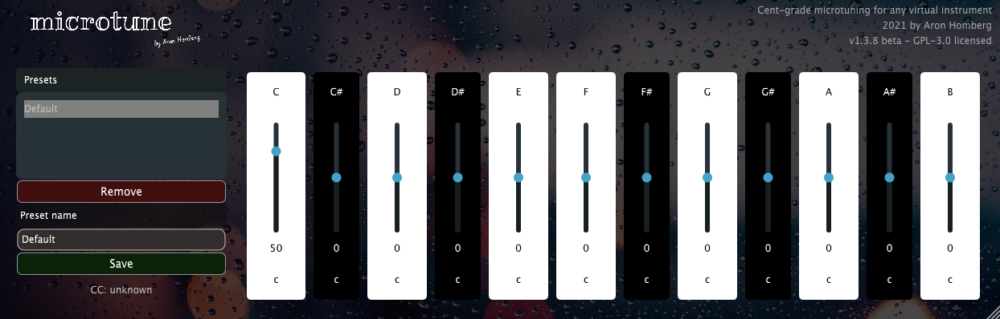

# Microtune

A MIDI FX plugin that microtunes any virtual instrument.

## Platforms and DAWs
Should be working on Windows, Mac and Linux using Reaper, Logic, Bitwig and others.
By default AAX is not built, but if you have the AAX sdk you will be able to enable this.

## Side-note, commercial alternative
After having the idea and implementing this project, the user EyalAmir in "The Audio Programmer" channel on Discord
told me that there is plugin with a similar idea in mind already on the market. 

So there is a commercial alternative available already: [PitchInnovations OI / FLUiD PiTCH](https://www.pitchinnovations.com/home/oi/)

I wasn't aware that this plugin already existed when I started implementing Microtune in September 2021. 
FLUiD PiTCH from PitchInnovations is a pretty decent plugin and a good alternative to this plugin if you also 
want additional features, like MPE support.

Microtune doesn't come with MPE support: Its pitch bend modulation applies to all MIDI notes played at the same time
and not to each single note individually. Therefore chord bending works with Microtune, but technically, it triggers 
the pitch bend for all notes hold at the same time, not each single note individually.

## Intention of this project / what it does
I've developed this project to implement an idea I head to give my digital instruments the possibility to be slightly detuned.
Just like a natural instruments (e.g. a guitar, or piano), I wanted virtual instruments to have some kind of mechanical "string tuner".

Using Microtune, you can tweak each "string" (tone) to differ from its "perfectly tuned" pitch. 
I didn't implement "slightly off octave purity" like it can happen in string instruments like the Guitar, 
because that is often an unwanted effect in music. However, if you like to have that, you can of course send me a PR here.

I also left out any other complex feature as I built this plugin also to learn about modern C++ development
and audio plugin development in general.

This codebase might be a good starting point to implement a JUCE based plugin of any kind (using CMake and PluginGuiMagic).

## Building
### Pre-requisites
- Windows, Linux, macOS based system
- C++ based developer toolchain such as Clang, VC++, etc.
- CMake
- VSCode (optional but recommended, see below)
- VST2 sdk (only if you need vst2 plugin)
- AAX (ProTools) SDK (only if you need it. disabled by default)

### Building
- Install developer tool chain on your system. Windows has been tested with MS C++, Mac has been tested with Clang, Linux with GCC on Ubuntu and Buster
- Install CMake on your system. Go to cmake.org/download
- If you want to set a particular version add -DAUDIOAPP_VERSION=9.9.9 in options below otherwise the version will be 0.9.0 
- VST2 - if you need it you need to add -DVST2_PATH=path-to-vst2-sdk-here to options below
- AAX - if you need it you need to install the sdk and edit the CMakefile
- AU - if you are building the AudioUnit add the option -DAUDIOAPP_IS_SYNTH=FALSE
- Update the git module dependencies

`git submodule update --init --recursive`

- Build (for release):

`cmake -B build [options]`
`cmake --build build --config Release`

### VSCode
Development is a lot easier with VSCode using the CMake extension. Simply point vscode at the root directory of the repo. It pretty much detects a cmake project and handles building without any issues.
- Install C++ extensions for vscode
- Install CMake Tools extensions for vscode

### XCode
If you want to use XCode on Mac, adjust the first cmake command to `cmake -B build -GXcode` and your build directory will contain xcode assets.

### License

GPL-3.0 License

### Contributors

Microtune has been developed by me, Aron Homberg (kyr0).

The project layout (template) and some code (build pipeline, CMake files) etc. is based on Stochas (https://github.com/surge-synthesizer/stochas).
Namely:

- Andrew Shakinovsky (rudeog)
- Paul (baconpaul)
- Maarten Kruithof (tyberion)

I'm really thankful for the open source work at Stochas!

Furthermore, I'd like to thank Daniel Walz (developer of Plugin GUI Magic) for his  
support on the "The Audio Programmer" Discord server.

The background image is by Max Bender, https://unsplash.com/photos/1YHXFeOYpN0

### In case you're using this code as a basis to your own JUCE plugin from scratch:

To manage/create your own git submodule configuration, run/adapt these commands:
`git submodule add https://github.com/juce-framework/JUCE lib/JUCE`

PGM (PluginGuiMagic) can also be added as a git submodule (example here is using the `develop` branch):
`git submodule add --branch develop https://github.com/ffAudio/PluginGuiMagic lib/foleys_gui_magic`

### Commands / macOS

`lipo` should print `x86_64 arm64` when running:
`lipo -archs ~/Library/Audio/Plug-Ins/Components/Microtune.component/Contents/MacOS/Microtune`

`auvaltool` should succeed when running ('AU VALIDATION SUCCEEDED.'):
`auvaltool -v aumi Micr Fluc`
